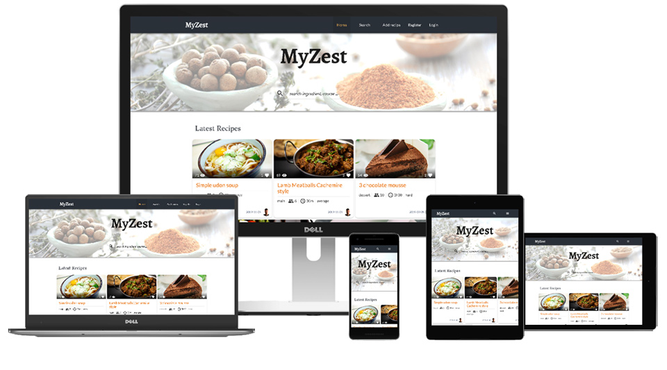

# MyZest




**_Live preview_** [on Heroku](https://myzest.herokuapp.com/)       

Table Of Content

- [Overview](#overview)
- [Features](#features)
- [Concept](#concept)
    - [UX](#ux)
        - [Persona](#persona)
        - [User Stories](#user-stories)
    - [Visual](#visual)
        - [Wireframes](#wireframes)
    - [Database](#database)
- [Tech used](#main-tech-used)
- [Running MyZest](#running-myzest)
- [Tests](#tests)
- [Deployment](#deployment)
- [Credits](#credits)
- [License](#license)


## Overview

**MyZest** is an online cookbook.  
It allows any users to find any recipes that their author wishes to share through this app.  
Authenticated users can save, share and retrieve any recipes on MyZest.  
Recipe authors will have (2nd release) the possibility to change the privacy of any of their recipes at any time. Keeping a recipe secret or share it with MyZest community.  


## Features

### Implemented features

- User Registration and Login.
- CRUD operations on recipes.  
At this stage the recipes are permanently erased on deletion (content and media).
- User fav recipes. Authenticated user can save a recipe to his favorite list.
- User search, filter and sort recipes from DB.  
At this stage a default sorting is applied to the search results (ie. ascending order for alphabetical, descending for fav score)
- Pagination.
- Recipe rating ( fav' count ).  
Initially planned as a 5 stars rating system. 
The fav count system prevents some users to feel offended by poorly rates from other users into competitive rating and ranking, which is not what I designed MyZest to be.
- User profile page.  
Users can edit and delete their profile. At this stage all recipes are erased on deletion. 
All faved recipe have their score decremented and any of the user’s recipe are removed from other users fav list.

### Features to add

- **MVP requirements**  
    - File hosting:  
     Users profile and recipes pictures needs to be hosted on separate server as Heroku holds files only temporally (Dynos reset).

### Second release

- Adding and editing recipes interaction :
	- Draggable fields to change ingredients or instructions steps order.
- Integrate allergens in search :
	- List of common allergens.
	- Text search in description, instructions and ingredients to suggest allergens.
- Adding more recipe details (Region, Category).
- Suggestions based on user's faved list.
- Suggest author to add optional details based on user searching.
- User sharing recipes ( email, fb, twitter )
- Recipe's privacy.  
Enables the users to decide for each of their recipe to share it or keep it invisible for himself only.


## Concept

### UX

#### Persona

- Marise
    - Profile  
    Mother of 3 young kids, busy cooking everyday. Young kids running around doesn’t help focusing and often misses a step or ingredient in her dish.  
    She needs a way to quickly find essential details about the dish she’s cooking ( easy and direct access to the recipe’s ingredients and instructions )
    - MVP  
    MyZest provides a minimalist layout to quickly navigate to these details.  
    The search recipes form is accessible all time and keeps record of the current search criteria. 
    That is to avoid refilling its fields and refine the the results until satisfaction ( hopefully an other user shares what she is looking for ).  
    From a recipe page Marise can login or create an account in 2 clicks / taps to quickly save it to her fav list. 
    So she never looses sight of her kids for too long ;)
- Tom
    - Profile  
    Looking to impress her girl-friend mastering the dishes she likes most. He’s poorly organized and always late looking for his car keys at last minute.  
    He needs a way to easily retrieve, save his cooking and any good alteration in its making. All this in one place.
    - MVP  
    I have tried to make the adding and updating recipe process accessible and easy to fill with a minimum fields required to keep it easy and fast.  
    Optional details can be added in the same add or edit forms which will ease other users search looking for these criteria.
- Yoko
    - Profile  
    Young female cooking enthusiast who likes to share her cooking skills and secrets.  
    Looking for a unique place showing all her recipes and get encouraging feedback.
    - MVP  
    MyZest provides a profile page so any users can easily access all her recipes as well as her favorites to get inspiration from her..  
    I have chosen the “fav count” score rating against the classic 5 star system as poor or voluntary unfair rating can be discouraging and even offensive leading to a negative emotional experience.  
    The author profile page provides Yoko’s score being the total number a recipe of her have been faved. Her overall score sits next to the number of recipes she’s sharing. Each recipe has its own scoring being the number it has been added to a user fav list.

#### User Stories

As Marise, I need to be able to quickly retrieve a recipe’s ingredient list and instructions.  
From landing page I can :  
- Login then access my profile to select a recipe of mine or one I’ve saved in my favorite list. Then click the one recipe to access clear list of ingredients and instructions.  
That is 3 page load – 4 clicks/taps and filling 2 fields.  
- Call the search form, change any criteria from its default state and validate. Her search criteria are saved from one page to next, saving her time to refine them quickly. Depending on the number of recipes returned she may browse through several pages. She can then select a recipe.  
That is 2 page load (plus search result pages) – from 2 clicks/taps and filling from 0 up to 6 fields.
_The amount of recipes by pages will grow with Database to keep browsing through search result faster._

As Tom, I want to try an alteration to a recipe I’ve executed already (and save it in MyZest).  
From landing page I can :  
- Login then access my profile. Choose one of my recipes. When ready to save changes click the edit icon. Then make any changes to the recipe and save them.
That is 4 page load, 5 clicks/taps and 2 login field process ( plus recipe form editing).  
_For further improvement, user will be able to rearrange instructions and ingredients list order._

As Yoko, I want to upload a recipe of mine and check its success in MyZest community.  
From landing page I can :  
- Login through the ‘add recipe’ nav link redirects me directly to the add recipe form after asking for login credentials. 
The form requires 6 essential fields (Name, description, difficulty, photo and minimum 1 ingredient and 1 instruction step ).  
That is 3 page load, 4 clicks/taps 2 login fields, plus form interaction ( 6 required fields ).

_On small devices burger button in navbar adds one tap for user stories requiring to login._

### Visual

MyZest is inspired by “material design”. With a mobile first approach, I’ve designed the layout to be minimalist using shadows to highlight only the main interaction items that the users are looking for ( recipe cards and navigation ).

**Color Scheme**  
I’ve been challenging myself choosing blue and orange tones. As complementary colors, they can be difficult to put together.
With enough white space to allow them to breath they provide contrast, clear and quick guidance through the layout between interaction elements and static content.

| Primary  | Secondary |
| ------------- | ------------- |
|  `#E86900` main  |  `#52607b` main |
|  `#F5B458` light  |  `#b4c4da` light |
|  `#F9EECB` bright |  `#2A3038` dark |
|  `#993918` dark |  |


The validation elements (as form inputs) keep the ‘standard’ red and green colors not to overload the first-time learning experience of the users.

**Icons**  
The initial idea of using material icons have been abandoned as it was overloading the page layout for mobile devices with no real benefits. 
Again, the main contents are recipes ingredients and instructions, and I don't expect many users to cook with their laptop (or desktop) on the kitchen worktop ;)

**Fonts**  
Many fonts have been taken into consideration :  

- Logo  
As the logo is text base, I have decided to look for fonts that contrast with the layout design being minimalist.
[‘Sahitiya’](https://fonts.google.com/specimen/Lato) stands between hand writing and the original type-writing with its nice eye catching thickness and curves yet remaining readable.

- Titles  
Therefore I’ve chosen [‘Donegal One’](https://fonts.google.com/specimen/Donegal+One) for the title of sections and articles as the letter spacing makes the font more readable as text content.

- Main text  
As for the main text [‘Lato’](https://fonts.google.com/specimen/Lato) fits nicely in the layout and was chosen for its readability and being without serif, contrasting with the logo and titles fonts. 
The user may find directly the main content he is looking for: recipe ingredients and instructions.

**Photographs**

Vision is human beings dominant sens, our perception relies at 80% on sight. Photographs are essential to show other users the expected result from following a recipe. 
It helps them identify almost instantly what they are after. That is why a recipe image is compulsory to add a recipe. 
This is reflected in my recipe cards design. 
Half its space for the dish photograph and other half for main details that the photograph may not visually provides (such as cooking duration, difficulty, serving ...).

#### Wireframes

For the wireframes I've used [wireframe|cc](https://wireframe.cc/), an online solution to quickly build simple wireframes.
They are in the wireframes directory, each device size in its sub-directory in .pdf and .png formats.  
- [mobile](./wireframes/mobile)
- [tablet](./wireframes/tablet)
- [desktop](./wireframes/desktop)

### Database

I’ve chosen to use MongoDB Atlas as database for its document orientated storage.

I wanted the forms interactions to be as simple and fast as possible. New documents are created with a number of fields as little as possible. 
Same goes with registering a user (not prompted to fill in a bio or avatar picture on first connection).

The [recipe](./database/recipe_schema.json) and [user](./database/user_schema.json) files show how a fully detailed document looks like or will look like after further improvements.

Each recipe criteria has its own collection for maintenance reason.
Further development will add image to each foodType, category and region criteria to be presented in cards for the users to browse.
They are retrieved by the app for the user when searching, adding or editing a recipe.
[db_relation](./database/db_diagram.png) shows the very few relations between collections.

## Main Tech Used

### Back-end

- [Python 3.6](https://docs.python.org/3.6/whatsnew/3.6.html)
- [Flask](https://flask.palletsprojects.com/en/1.1.x/quickstart/) framework.
- [MongoDB](http://mongodb.org)
    - I use MongoDB Atlas to host recipes and users data.
    - [PyMongo](https://api.mongodb.com/python/current/) is used through the [Flask-PyMongo](https://flask-pymongo.readthedocs.io/) extension.
- [Flask-Bcrypt](https://flask-bcrypt.readthedocs.io/en/latest/) to secure the user's password.

### Front-end

- Styling is written in [SCSS](https://sass-lang.com)
- [jQuery](https://jquery.com/)
	- **jQuery** library is used to ease DOM manipulation.
- [MaterializeCSS](https://materializecss.com/)
    - The **MaterializeCSS** framework provides default styling and animations as a good starting point.
- [noUiSlider](https://refreshless.com/nouislider) provides customized range sliders used in recipe search.

### Testing

- [Selenium 3.1](https://selenium.dev)
    - I use Selenium WebDriver with Python for End To End testing to ensure MyZest provides appropriate feedback to the user interaction.


## Contributing

### Running MyZest

1. You need to fork the repo
2. Set the Virtual Environment ( as `virtualenv venv && source venv/bin/activate` )
3. Install the project dependencies
   ```bash
   pip install -r requirements.txt
   ```
4. You need to create a `config.py` file in the app directory in which you will set :
    - URI to your database ( I’m using Atlas )
    - Secret key for Flask secure cookies  
    
    These are imported in `myzest/__init__.py`.  
    _Use `rename_as_config.py` in deployment branch._
5. Run the app  
    ```bash  
    python run.py  
    ```


### Tests
  
***IMPORTANT !  
Make sure to run your tests using a different database***. As well educated tests they clean up after themselves !  
_It also makes some tests and assertions easier to write.
You need to set a different URI in the `config.py` file ( as `test_mongo_uri = <uri> ` )_  

#### Running Unit tests

Simply run unittest with ` TEST ` environment variable :
```bash
TEST=true python -m unittest discover -s tests/unit/
```

#### Running End-to-End tests

Make sure Selenium and the correct browsers [driver](https://selenium.dev/selenium/docs/api/py/index.html#drivers) are installed :

1. Start Flask server in terminal :  
    ```bash  
    TEST=true python run.py  
    ```  
2. Run the tests in a separate terminal :
    ```bash
    TEST=true python -m unittest discover -s tests/e2e/
    ```

#### Validations

**HTML**  

[W3C HTML Validator](https://validator.w3.org/) raises errors that concern the Jinja's templating syntax, which is not recognized.

**CSS**  

I'm using experimental vendor extensions and extended pseudo-element selectors, which are not standardized yet.  
Hence the following warnings from [W3C CSS Validator](https://jigsaw.w3.org/css-validator/) :

- `-moz-appearance` & `-webkit-appearance`  
I use `appearance` on numbers input to remove the redundant incrementation buttons. The slider
beneath is preferred as it provides better user interaction experience.  
_Chrome requires the additional pseudo-element selector : `-webkit-outer-spin-button` and `-webkit-inner-spin-button`._  
- `input[type=range]::-moz-range-thumb` & `::-webkit-slider-thumb`  
They are used to override the color of the range sliders handles.

**JavaScript**

I've used [JSHint](https://jshint.com/) to check JavaScript coding.
- Warnings :
    - `Bad escaping of EOL. Use option multistr if needed.`. Ignored: multiline strings are supported since ES5.  
    - `let`. Ignored: 'let' is available in ES6.

- Undefined variables :  
    - `$` : jQuery.
    - `M` : Materialize framework.
    - `noUislider` : noUiSlider. Loaded separately.

**Python PEP8**

I have used [pep8online](http://pep8online.com/) to check my Python code.
- `E501: line too long` : I'm personally ok with lines a few characters over 79.
- `E402: module level import not at top of file ` : Voluntary Python cyclic import `__init__.py` & `routes.py`.

### Deployment

MyZest is deployed on [Heroku](https://myzest.herokuapp.com/)

Deployment on Heroku requires : 
- Procfile  
Generated as `echo "web: python run.py > Procfile"`
- Requirements to be up to date
    ```bash
    pip freeze --local > requirements.txt
    ```
- Set the app to run out of debug mode and match Heroku requirements
    - run.py in root directory:  
    - ```python  
      app.run(host=os.getenv('IP'),  
      port=int(os.getenv('PORT')),  
      debug=False)  
      ```
    - Set these in your Heroku environment or using Heroku CLI (login required)
    - ```bash  
      heroku config:set IP=0.0.0.0  
      heroku config:set PORT=5000  
      ```
- Scale Dynos
```bash
heroku ps:scale web=1
```

Once this is correctly setup, you can commit push from deployment branch to heroku's master:
`git push <remote> deployment:master`

## Credits

### Author

My Self: [Gareths3](https://github.com/gareths3)

### Acknowledgments

Thanks to my mentor [Antonija Šimić](https://github.com/tonkec), for being picky, challenging me and 
pushing my boundaries through positive feedback !

#### Code

When working on a solution to serialize ObjectId into the session object
I came into [this solution](https://stackoverflow.com/a/16586277) that works like a charm :
```python
class JSONEncoder(json.JSONEncoder):
    def default(self, o):
        if isinstance(o, ObjectId):
            return str(o)
        return json.JSONEncoder.default(self, o)
```
I learned couple more things about JSON along the way !

#### Package structure

Thanks to [Corey Schafer](https://github.com/CoreyMSchafer) for his inspiring Flask tutorial series 
where the circular import problem in this architecture is well explained.

### Content

**Media**  
Recipe pictures from [Pexels](https://www.pexels.com/), [Pixabay](https://pixabay.com/).  
Users profile pictures taken from [Diverse UI](https://diverseui.com)

**Text**  
I graciously provided my own recipes ;) I do hope you like them.  
For the Terms of use and privacy pages some help and inspiration came from :
- [Terms Feed](https://www.termsfeed.com/)
- [GDPR](https://gdpr.eu/privacy-notice/)
- [WIPO](https://www.wipo.int/portal/en/)


## License

This project is licensed under the MIT License.
See the [LICENSE.md](./LICENSE.md) file for license rights and limitations (MIT).
